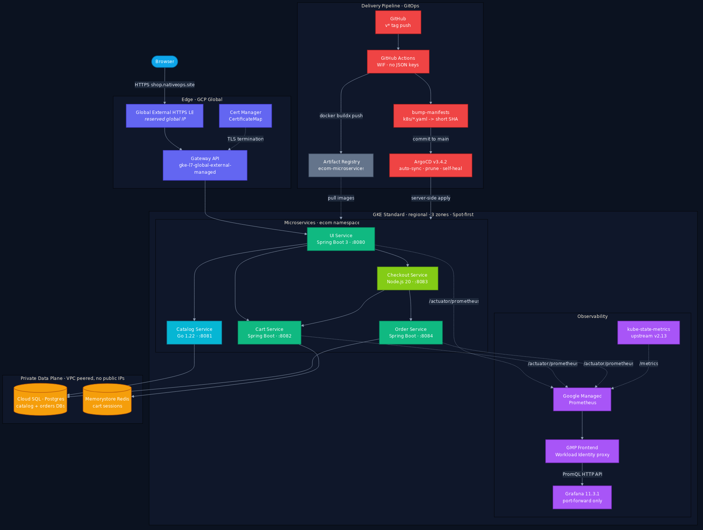
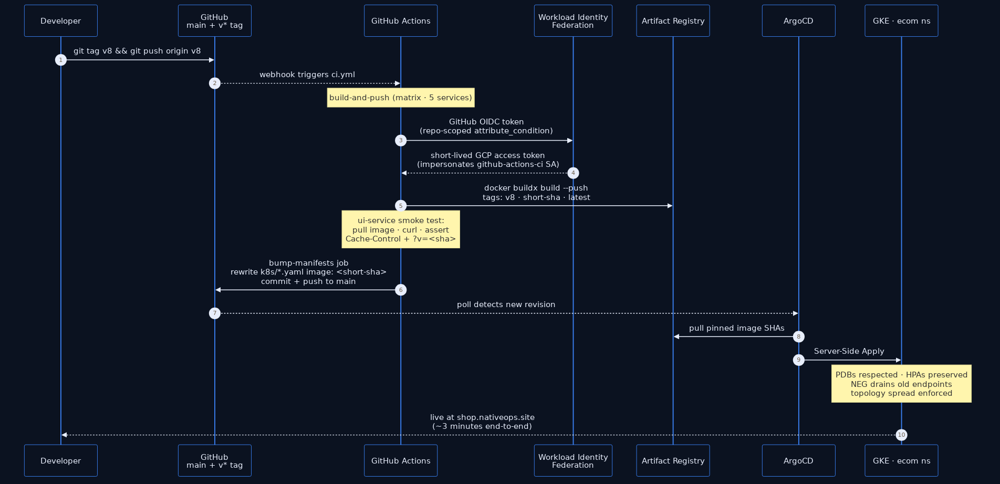
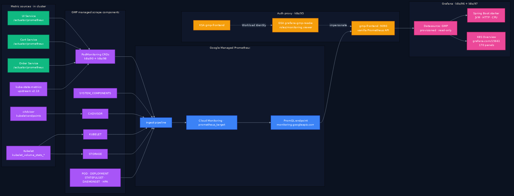

# Nova Store — Microservices E-Commerce on GKE

A polyglot microservices storefront that ingests products from the public [FakeStore API](https://fakestoreapi.com/products), serves them from a vibrant Spring Boot + Thymeleaf UI, and runs in production on **GKE Standard** behind a global HTTPS load balancer — released via signed `v*` tags and continuously deployed by **ArgoCD**.

**Live:** [shop.nativeops.site](https://shop.nativeops.site)

---

## Highlights

- **5 services**, three runtimes — Go (catalog), Spring Boot 3 (cart / order / ui), Node.js 20 (checkout).
- **GitOps end-to-end** — push a tag, the cluster updates itself. No `kubectl apply` in any developer workflow.
- **Keyless CI** — GitHub Actions authenticates to GCP via Workload Identity Federation. No JSON keys anywhere.
- **SHA-pinned releases** — every release pins immutable image digests in `k8s/*.yaml`; rollback is `git revert`.
- **Three-layer cache enforcement** — Spring filter + GKE Gateway `ResponseHeaderModifier` + CI smoke test, so a UI deploy is **instantly visible** to every user without browser tricks.
- **In-cluster observability** — Google Managed Prometheus scrapes every service's `/actuator/prometheus` + cAdvisor + kube-state-metrics; Grafana runs in-cluster, queries GMP via a Workload-Identity-authed proxy (no GCP creds in Grafana), ships a starter Spring Boot dashboard + the [grafana.com/15661](https://grafana.com/grafana/dashboards/15661) K8s dashboard pre-loaded.
- **Multi-region-ready VPC, single-knob naming** — Every named resource is prefixed `<business_division>-<environment_name>-` (e.g. `it-prod-vpc`) from `local.name` so two tfvars flips rebrand the whole stack. `var.regions` is a `map(object)` — current layout fans out across `us-central1` (GKE) + `us-west1` (VMs); add a third region with one map entry. Each region's `gke` / `vm` / `proxy` subnets are independently opt-in; CIDR primaries are sliced from the per-region `vpc_cidr` via `cidrsubnet`.
- **Spot-first economics** — GKE `ComputeClass` prefers Spot VMs with on-demand fallback (~70% cheaper).
- **Resilient under Spot preemption** — every service runs at `minReplicas=2` with `topologySpreadConstraints` (hostname + zone). A single node preemption never takes a service to zero; load balancer stays healthy.
- **Private data plane** — Cloud SQL Postgres and Memorystore Redis on a VPC with no public IPs, tuned for the replica fan-out (`max_connections=75`, HikariCP capped per pod).
- **Modern storefront** — top-nav layout, ambient gradient background, animated hero, dark/light mode with `localhost`-defaults-to-dark, `?v=<sha>` cache-busting on every static asset.

---

## Architecture



*VPC with private services access (no public IPs on the data plane). ArgoCD watches `main:k8s/` and syncs to the `ecom` namespace. UI is the only service exposed to the internet via the global LB; everything else is cluster-internal. Diagram source: [docs/diagrams/architecture.mmd](docs/diagrams/architecture.mmd).*

| Service       | Language          | Port | Storage     | Deploy                       |
|---------------|-------------------|------|-------------|------------------------------|
| `ui-service`  | Java 21 / Spring  | 8080 | —           | `Deployment` + HPA + PDB     |
| `catalog-service` | Go 1.22       | 8081 | Postgres    | `Deployment` + HPA + PDB     |
| `cart-service`    | Java 21 / Spring | 8082 | Redis    | `Deployment` + HPA + PDB     |
| `checkout-service`| Node.js 20    | 8083 | —           | `Deployment` + HPA + PDB     |
| `order-service`   | Java 21 / Spring | 8084 | Postgres | `Deployment` + HPA + PDB     |

---

## Quick start — local (Docker Desktop)

The full inter-service mesh runs in compose: Postgres (with multi-DB init), Redis, all 5 services, healthchecks, `depends_on` wiring.

```bash
# From repo root
docker compose up --build -d

# Open the storefront — defaults to dark theme on localhost
open http://localhost:8080

# Tear down
docker compose down
```

On first boot, `catalog-service` seeds products from FakeStore API into Postgres, then schedules a 6-hour refresh.

### Local workflow rule

**Compose-first**: every code change goes through `docker compose up --build` and a full purchase-flow smoke test (home → product → add to cart → cart → checkout) **before** any tag/push to GKE. Catches inter-service regressions that a single-service unit test can't.

---

## Deploy to GCP — from zero

Prerequisites: a GCP project, billing enabled, `terraform`, `gcloud`, and `kubectl` installed.

### 1. Provision infrastructure (Terraform)

```bash
cd infrastructure/terraform
cp terraform.tfvars.example terraform.tfvars   # edit project_id, domain, etc.
terraform init                                  # connects to GCS remote state
terraform apply
```

State is stored remotely on GCS at `prod/c1-ecommerce-project/` — the bucket name is set in [`backend.tf`](infrastructure/terraform/backend.tf) (kept out of the README so it isn't searchable in public mirrors). No local `.tfstate` file is created. Bucket has versioning enabled so any apply can be rolled back. New contributors just need `gcloud auth application-default login` + `terraform init` — no state file sharing required.

This provisions:

| Layer              | Resource                                                                 |
|--------------------|--------------------------------------------------------------------------|
| Network            | Global VPC fanned out across every key in `var.regions` (currently 2: `us-central1` + `us-west1`). Per region: opt-in `gke` / `vm` / `proxy` subnets via `cidrsubnet` slicing; Cloud Router + NAT only where needed. Single pinned `private_services_address` for SQL + Redis peering. |
| Compute            | GKE Standard regional cluster in `var.gke_region` (3 zones, system pool + NAP) |
| Data               | Cloud SQL Postgres (private) · Memorystore Redis (basic)                  |
| Image registry     | Artifact Registry `ecom-microservices`                                    |
| Ingress            | Reserved global IP · Cert Manager certificate + CertificateMap            |
| GitOps             | ArgoCD via Helm chart `9.5.15` (ships ArgoCD v3.4.2)                     |
| ArgoCD app         | `ecom` Application: auto-sync, prune, self-heal · ignoreDifferences for GKE NEG annotations |
| CI identity        | Workload Identity Federation pool + GitHub OIDC provider · SA scoped to Artifact Registry only |
| Observability      | GMP enabled on the cluster · 9 managed scrape components (SYSTEM_COMPONENTS + CADVISOR + KUBELET + STORAGE + POD + DEPLOYMENT + STATEFULSET + DAEMONSET + HPA) · GSA `grafana-gmp-reader` (monitoring.viewer) bound via WI to the in-cluster `gmp-frontend` KSA |

See [`infrastructure/terraform/README.md`](infrastructure/terraform/README.md) for the full module-by-module rundown.

### 2. Wire the GitHub repo to GCP

After `terraform apply`, set three things in **Repo Settings → Secrets and variables → Actions**:

```bash
gh secret   set GCP_WIF_PROVIDER    --body "$(terraform output -raw github_actions_wif_provider)"
gh secret   set GCP_SERVICE_ACCOUNT --body "$(terraform output -raw github_actions_sa_email)"
gh variable set PROJECT_ID          --body "<your-project-id>"
```

- `GCP_WIF_PROVIDER` + `GCP_SERVICE_ACCOUNT` are **secrets** — masked in logs.
- `PROJECT_ID` is a **variable** — project IDs aren't sensitive (they appear in every image URL), and storing it as a variable means you can change the target project from the UI without a commit.

The WIF provider is **repo-scoped** via an `attribute_condition` — only OIDC tokens from `aslamchandio/web-app-project` can mint tokens for the CI service account. The SA's only IAM grant is `roles/artifactregistry.writer` on the `ecom-microservices` repo (no project-wide permissions).

### 3. Cut a release

```bash
git tag v1
git push origin v1
```

That's it. See the release flow below for what happens next.

---

## Release flow (GitOps)



*From `git tag v8 && git push` to live: ~3 minutes. WIF on every step so no JSON keys ever exist. Image SHAs are immutable; rollback is `git revert <bump-commit>`. Diagram source: [docs/diagrams/release-flow.mmd](docs/diagrams/release-flow.mmd).*

**Rollback** is `git revert <bump-commit>` — the manifests pin to immutable SHAs, so ArgoCD just re-applies the previous version.

---

## Three-layer cache-control enforcement

Static asset divergence between local and prod was a real problem (browsers heuristically cached HTML and never picked up new CSS URLs). Fixed at three independent layers so no single regression can re-break it:

| Layer | File | Role |
|---|---|---|
| **App** | [`services/ui-service/.../WebMvcConfig.java`](services/ui-service/src/main/java/com/ecom/ui/config/WebMvcConfig.java) | `OncePerRequestFilter` sets `Cache-Control: no-cache` on HTML; resource handlers set `immutable, 1yr` on `/css/**` and `/js/**` |
| **Gateway** | [`k8s/60-gateway.yaml`](k8s/60-gateway.yaml) | GKE HTTPRoute uses `ResponseHeaderModifier` filters — GLB sets the same headers, so the app could vanish entirely and prod would still cache correctly |
| **CI guard** | [`.github/workflows/ci.yml`](.github/workflows/ci.yml) | Smoke step pulls the freshly-built ui-service image, asserts both headers present + `?v=<sha>` query in HTML. PR fails on regression |

Plus the build-time cache-bust query: every release bakes its short SHA into `APP_VERSION` (via Docker `ARG GIT_SHA`) and the layout fragment appends `?v=${appVersion}` to every static asset URL. New deploy → new asset URL → forced browser refetch.

---

## Observability

End-to-end visibility, all GitOps-managed, zero JSON keys.



*Grafana holds no GCP credentials — the gmp-frontend pod (Workload Identity → GSA `grafana-gmp-reader`, `roles/monitoring.viewer`) proxies all queries to Cloud Monitoring on its behalf. Diagram source: [docs/diagrams/observability.mmd](docs/diagrams/observability.mmd).*

| Piece | File | Notes |
|---|---|---|
| Java app metrics | `services/{ui,cart,order}-service/pom.xml` + `application.yml` | Micrometer Prometheus registry; `/actuator/prometheus` in `management.endpoints.web.exposure` |
| GMP scrape | [`k8s/90-podmonitoring.yaml`](k8s/90-podmonitoring.yaml) | PodMonitoring CRDs for the 3 Java services (Go + Node services TBD) |
| Cluster metrics | [`infrastructure/terraform/gke.tf`](infrastructure/terraform/gke.tf) | 9 `monitoring_config.enable_components` flags — gives PromQL access to `container_*`, `kube_*`, `kubelet_volume_stats_*` |
| GMP auth proxy | [`k8s/95-gmp-frontend.yaml`](k8s/95-gmp-frontend.yaml) | `prometheus-engine/frontend:v0.18.0-gke.2` (image version matches cluster GMP operator) |
| IAM | [`infrastructure/terraform/grafana.tf`](infrastructure/terraform/grafana.tf) | GSA `grafana-gmp-reader` with `roles/monitoring.viewer` + WI binding for KSA `ecom/gmp-frontend` |
| Grafana | [`k8s/96-grafana.yaml`](k8s/96-grafana.yaml) | Deployment + Secret + 10Gi PVC + datasource/provider ConfigMaps + projected dashboards volume |
| K8s dashboard | [`k8s/97-grafana-dashboard-k8s.yaml`](k8s/97-grafana-dashboard-k8s.yaml) | grafana.com/15661, 170 panel datasource refs patched to `uid: gmp` |

### Access

Port-forward only, no public exposure (it's an ops tool, not user-facing):

```bash
kubectl -n ecom port-forward svc/grafana 3000:3000
# open http://localhost:3000  →  admin / ChangeMeOnFirstLogin!  (rotate on first login)
```

Dashboards land in the `ecom` folder. Anything created in the UI persists to the PVC; the two provisioned dashboards are intentionally **read-only** so UI edits can't drift from git — use **Save as…** to fork a copy.

### Adding another community dashboard

```bash
# 1. download + patch the datasource uid
curl -sSL https://grafana.com/api/dashboards/<ID>/revisions/latest/download \
  | sed 's/${DS__SOMETHING}/gmp/g' > dash.json

# 2. wrap in a ConfigMap
kubectl create configmap grafana-dashboards-<name> \
  --from-file=<name>.json=dash.json -n ecom \
  --dry-run=client -o yaml > k8s/9X-grafana-dashboard-<name>.yaml

# 3. add a configMap entry under volumes.projected.sources in 96-grafana.yaml
# 4. commit, ArgoCD syncs, Grafana reloads (~30s)
```

---

## Project layout

```
.
├── services/                       Microservices (one folder + Dockerfile per service)
│   ├── catalog-service/            Go · FakeStore sync · Postgres
│   ├── cart-service/               Spring Boot · Redis
│   ├── checkout-service/           Node.js Express · orchestrates cart → order
│   ├── order-service/              Spring Boot · Postgres
│   └── ui-service/                 Spring Boot · Thymeleaf · WebMvcConfig (cache) · ViewModelAdvice (APP_VERSION)
│
├── infrastructure/terraform/       GCP IaC (network, GKE, SQL, Redis, AR, ArgoCD, WIF, certmap)
│
├── k8s/                            Manifests synced by ArgoCD
│   ├── 00-namespace.yaml
│   ├── 05-compute-class.yaml       ComputeClass: Spot-first, on-demand fallback
│   ├── 10..50-*.yaml               Deployment + Service per microservice
│   ├── 60-gateway.yaml             Gateway (HTTPS via certmap) + HTTPRoutes + cache headers + HealthCheckPolicy
│   ├── 70-hpa.yaml                 HorizontalPodAutoscaler per service (minReplicas=2)
│   ├── 80-pdb.yaml                 PodDisruptionBudget per service (maxUnavailable=1)
│   ├── 90-podmonitoring.yaml       PodMonitoring CRDs telling GMP to scrape /actuator/prometheus
│   ├── 95-gmp-frontend.yaml        GMP query proxy (WI-authed) — translates Prometheus API → Cloud Monitoring
│   ├── 96-grafana.yaml             Grafana 11.3.1 + PVC + datasource + provisioned starter dashboard
│   └── 97-grafana-dashboard-k8s.yaml  K8S Dashboard (grafana.com/15661) as ConfigMap
│
├── .github/workflows/ci.yml        Build → push → bump-manifests, with cache-header regression test
├── docker-compose.yml              Local dev stack
└── scripts/                        Helpers (db init, image generation)
```

---

## UI

Spring Boot + Thymeleaf storefront with a vibrant top-nav layout. Includes:

- **Light + dark themes** via CSS variables + `localStorage` persistence + pre-paint script (no flash-of-wrong-theme)
- **`localhost` defaults to dark** so local dev feels distinct from prod
- **Ambient gradient orbs** + SVG-noise grain background
- **Playfair Display hero** with animated gradient text + floating decorative cards
- **Glassmorphic top nav** with sticky search (press `/` to focus from anywhere)
- **Client-side product filter** (debounced) over the server-rendered grid
- **Server-side category filter** via `?category=` query
- **Mobile responsive** — burger nav, hidden search, 2-col grid below 640px
- **`prefers-reduced-motion` respected**

---

## Operational notes

| Topic | Detail |
|---|---|
| **GKE node strategy** | Minimal system pool (`e2-small` × 1/zone) for kube-system. App workloads land on Spot via `ComputeClass`, scheduled by NAP. Scales to zero when idle. |
| **Availability under Spot** | HPA `minReplicas: 2` + `topologySpreadConstraints` on hostname AND zone (soft, `ScheduleAnyway`). 1 of 2 replicas going down (Spot preemption, drain, OOM) never makes the service unreachable. PDB `maxUnavailable=1` (in [`80-pdb.yaml`](k8s/80-pdb.yaml)) caps voluntary disruption. |
| **TLS** | Cert Manager certificate bound via CertificateMap; Gateway references the map by annotation. No `tls:` block on the listener (incompatible with the certmap-only pattern). |
| **HTTP→HTTPS** | Separate HTTPRoute on the `:80` listener returns `301` to `https://`. |
| **Health checks** | `HealthCheckPolicy` points the GLB at `/actuator/health/readiness` on ui-service (faster than `GET /` during warm-up). |
| **ArgoCD ignored diffs** | `cloud.google.com/neg-status` (controller-written) and `cloud.google.com/neg` (GKE re-serializes JSON to compact form — would otherwise flap). HPA `/spec/replicas` (managed by autoscaler, not git). |
| **DB connection budget** | Cloud SQL `max_connections=75` (raised from f1-micro default ~25 via [`cloudsql.tf`](infrastructure/terraform/cloudsql.tf) `database_flags`). Spring Boot pods cap HikariCP at 5 per pod (`SPRING_DATASOURCE_HIKARI_MAXIMUM_POOL_SIZE`) so 2 replicas × 2 Postgres-using services stays well under the ceiling. **If you scale replicas, recheck this** — the math fans out fast. |
| **Secrets** | Cloud SQL DB password generated by Terraform's `random_password`, written to `k8s/generated-secrets.yaml` (gitignored), mounted via workload identity. |

---

## Tech stack

**Languages:** Go 1.22 · Java 21 (Spring Boot 3 / WebFlux / MVC) · Node.js 20 · Thymeleaf · vanilla JS/CSS

**Infrastructure:** Terraform · GKE Standard + NAP + Gateway API · Cloud SQL · Memorystore Redis · Artifact Registry · Cloud Certificate Manager · Cloud NAT

**Delivery:** GitHub Actions · Workload Identity Federation · ArgoCD (Helm chart 9.5.15 → ArgoCD v3.4.2) · docker buildx with GHA cache

**Observability:** Spring Boot Actuator (`/actuator/health/readiness` + `/actuator/prometheus`) · Micrometer Prometheus registry on the 3 Java services · Google Managed Prometheus (CADVISOR + KUBELET + STORAGE + kube-state-metrics components) · in-cluster Grafana 11.3.1 with GMP-frontend auth proxy (Workload Identity, no JSON keys) · provisioned Spring Boot starter dashboard + K8s overview dashboard ([grafana.com/15661](https://grafana.com/grafana/dashboards/15661)) · Cloud Logging

---

## License

This project is provided as a portfolio reference implementation. Contact [@aslamchandio](https://github.com/aslamchandio) for reuse questions.
